Untitled
================
Marcelo Prudente
20 de setembro de 2018

Tipos de gráficos

Tipos de gráficos
-----------------

-   **Histogramas**: representa a distribuição de dados numéricos contínuos.
    -   **densidade**
-   **Caixas**: representa a variação de categorias de dados numéricos.
-   **Barras**: ótimo para sumarizar dados categóricos.
-   **Dispersão**: aponta a relação entre duas variáveis contínuas.

Baixar dados para analise
-------------------------

``` r
library(readr)
library(ggplot2)
dados_sociais <-read_csv2("C:/curso_r/dados/dados_sociais.csv", 
                          locale = locale(encoding = "LATIN1"))
# criar variável para regiao
dados_sociais$regiao <- substr(dados_sociais$uf, 1, 1)
```

Sistema
-------

-   os 4 gráficos com a base do sistema:

``` r
# Histograma
hist(dados_sociais$esp_vida)
```

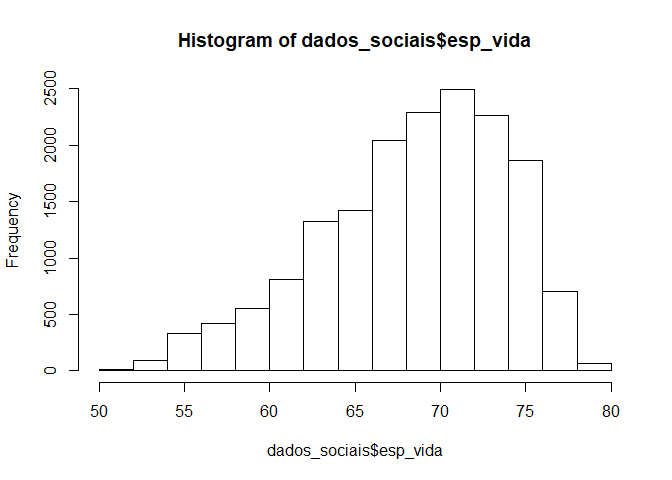

``` r
# Diagrama de Caixas
with(dados_sociais, boxplot(esp_vida  ~factor(uf)))
```

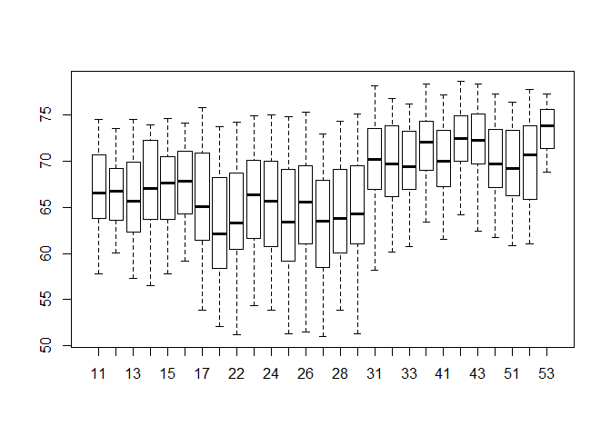

``` r
# Barras
p <- table(dados_sociais$uf)
barplot(p)
```

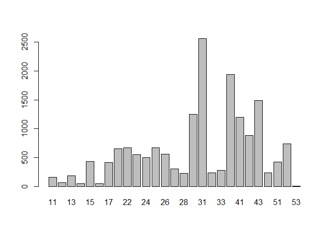

``` r
# Dispersão
with(dados_sociais, plot(esp_vida, log(rdpc)))
```

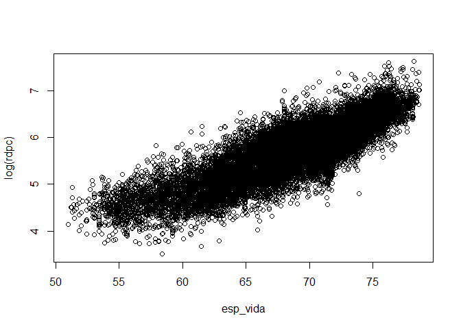

-   Tente no seu pc

ggplot2
=======

Porque ggplot2?
---------------

-   É uma alternativa mais elegante aos gráficos com:
    -   cores automáticas para os gráficos
    -   temas pré-estabelecidos (como no excel)
    -   facilidade de customização
    -   [**outros:** *veja aqui*](https://github.com/tidyverse/ggplot2/wiki/Why-use-ggplot2)
-   Em resumo, é possível mexer em todos os aspectos do gráfico

Como funciona o ggplot2
-----------------------

-   O ggplot2 aplica a gramática de gráficos de [*Wilkinson*](https://www.amazon.com/Grammar-Graphics-Statistics-Computing/dp/0387245448)
-   A ideia central é criar os gráficos em camadas com os seguintes componentes:
    -   banco de dados
    -   coordenadas (x , y) - estética
    -   camadas geométricas

abordagens do ggplot2
---------------------

-   Há duas abordagens:
    -   **qplot()** - gráficos rápidos (*quick plot*)
    -   **ggplot** - gráficos mais elaborados

qplot(): vizualizações rápida
-----------------------------

-   É possível plotar quase tudo com o **qplot**. Entretanto, você não alcançará todo o potencial do ggplot.
-   **qplot()** é o mesmo que *quick plot* e segue a lógica de camadas. Veja!


-   Veja que é possível criar histogramas e gráficos de caixas com facilidade,

``` r
# Histograma
qplot(esp_vida, data = dados_sociais)
```

    ## `stat_bin()` using `bins = 30`. Pick better value with `binwidth`.

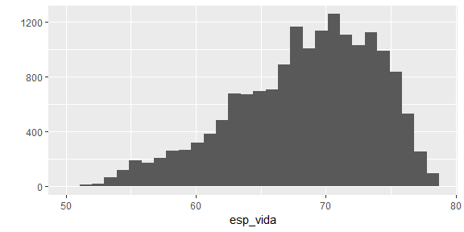

``` r
# Boxplot
qplot(x = factor(uf),y = esp_vida, 
      data = dados_sociais, geom = "boxplot")
```


    -   <https://www.rstudio.com/wp-content/uploads/2015/03/ggplot2-cheatsheet.pdf>
-   Porém, é importante saber o tipo de variável com que irá trabalhar.

-   Na prática, há diversos sites com inúmero exemplos de tabulação de dados que podem ser facilmente replicados. O site abaixo traz 50 exemplos de gráficos tabuláveis ggplot.
    -   \*<http://r-statistics.co/Top50-Ggplot2-Visualizations-MasterList-R-Code.html*>

Histogramas
-----------

Voltando aos histogramas, a formatação segue a mesma lógica apresentada anteriormente.

``` r
ggplot(dados_sociais, aes(x = esp_vida)) +
  geom_histogram(color = "blue", fill = "green")
```

    ## `stat_bin()` using `bins = 30`. Pick better value with `binwidth`.

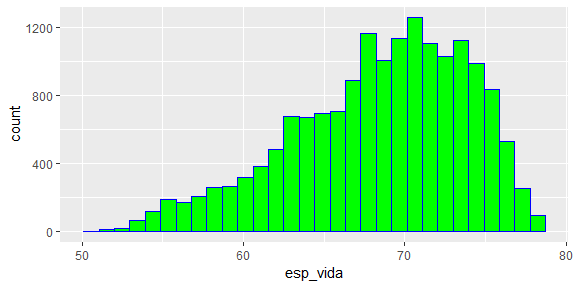

Note o belo gráfico abaixo! Adicionamos mais uma camada ao histrograma, uma linha com a contagem dos casos, e controlamos as cores, o tamanho e o tipo da linha.

``` r
ggplot(dados_sociais, aes(x = esp_vida)) +
  geom_histogram(color = "red", fill = "black") +
  geom_freqpoly( size = 1.5, color = "green", lty = 2)
```

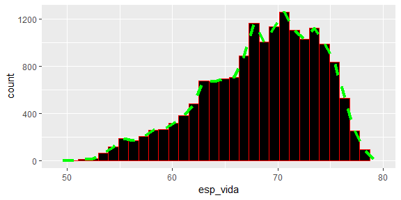

Densidade
---------

Os gráficos de densidade são versões mais suavizadas do histograma. Observe o código e tente entender o que foi feito.

``` r
ggplot(dados_sociais, aes(x = esp_vida, color = factor(ano))) +
  geom_density(aes(fill = factor(ano), alpha = 1))
```

% 
  group_by(uf) %>%
  summarise(rdpc = mean(rdpc))

ggplot(rdpc_uf, aes(factor(uf), rdpc)) + 
  stat_sum( geom = "bar")
```

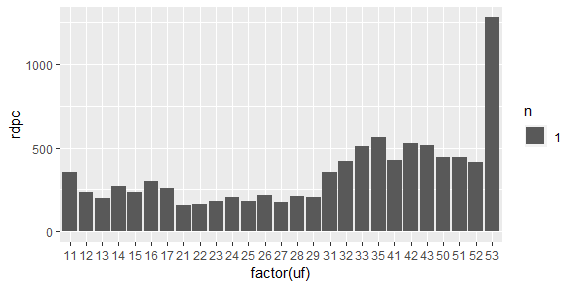

Ou mesmo diretamente no gráfico por meio do **stat\_summary().**

``` r
dados_sociais %>%
  ggplot(aes(factor(uf), rdpc)) +
  stat_summary(fun.y = "mean", geom = "bar")
```

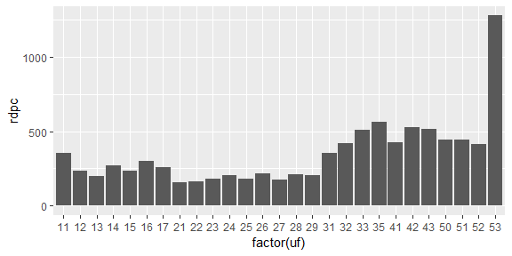

Veja que o *stat\_summary* solicita qual a função transformará o valor de y e qual o *geom* será utilizado. Mais prático, não?

Sumarizar por grupo
-------------------

-   É possível utilizar o **stat\_summary()** para criar gráficos por grupos. Abaixo, o gráfico especifica a média por ano da variável renda per capita

``` r
# criar plot de base
dados_sociais %>% 
  ggplot(aes(ano, rdpc, color = factor(regiao)) ) + 
  stat_summary(fun.y = "mean", geom = "line") 
```

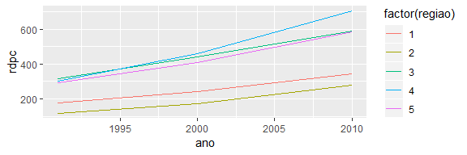

Barras por grupo
----------------

-   Observe que o **stat\_summary()** permite versatilidade

``` r
g4 <- dados_sociais%>% 
ggplot(aes(regiao, tx_analf_15m, fill = as.factor(ano)))+ 
stat_summary(fun.y = "mean", 
             geom = "bar", position = "dodge") 
g4
```

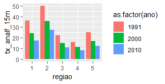

Subgráficos
===========

facet()
-------

-   Ainda, é possível criar subgráficos por grupos - por exemplo, um gráfico para cada região.

``` r
# criar plot de base
p <- dados_sociais %>%
  ggplot(aes(esp_vida, rdpc)) + 
  geom_point( color = "steelblue") 
# facet em um mesma grade de imagem
p + facet_grid(. ~ regiao)
```

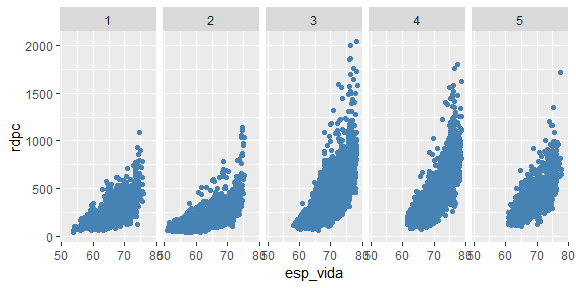

facet()
-------

-   Também, é possível criar subgráficos por grupos com mais grades.

``` r
# facet wrap
p + facet_wrap( ~ regiao, ncol = 2)
```

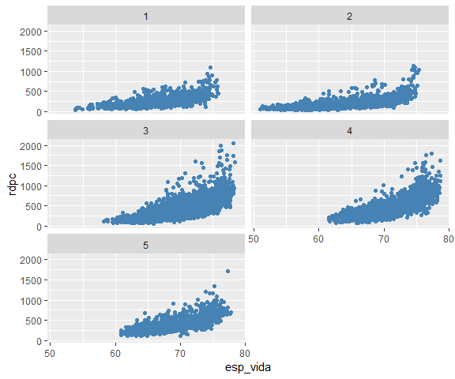

Camadas de ajuste
=================

Títulos
-------

-   Veja como é possível modificar os títulos dos eixos e legendas

``` r
# elaborar gráfico
graf <- dados_sociais %>% 
  ggplot(aes(esp_vida, rdpc, color = factor(ano)) ) + 
  geom_point(shape = 1) 

# aplicar títulos
graf <- graf + 
  labs( title = "Renda x Esperança de Vida", 
        caption = "Fonte: IBGE. Elaboração própria",
        x = "Esperança de Vida", 
        y = "Renda per capita", 
        color = "Anos")
graf
```

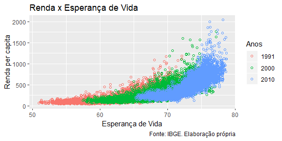

Ajustar as escalas
------------------

Facilmente as coordenadas são alteradas

``` r
graf <- graf + 
  scale_x_continuous(breaks = seq(50, 80, 5),
                     labels = function(x) paste(x, "anos")) +
  scale_y_continuous(breaks = seq(0, 3000, 250), 
                     labels = function(x) paste("R$", x)) +
  scale_color_manual(values = c("darkolivegreen1", "steelblue", "brown2"))

graf
```

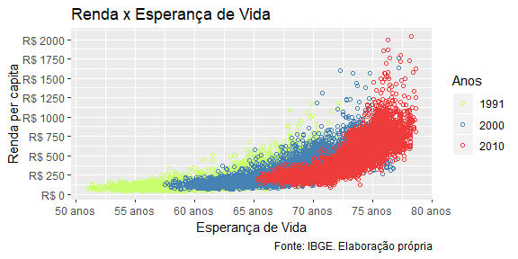

Temas
=====

theme
-----

-   Por fim, o **ggplot()** permite modificar os temas dos gráficos.
    -   Há alguns temas prontos, mas é possível editar o seu próprio: **help(theme)**

``` r
graf +  theme_minimal()
```

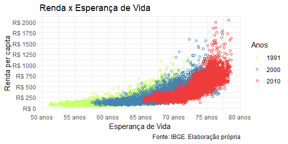

Crie seu próprio tema
---------------------

Outra forma de lidar com os dados

``` r
graf +  theme(
        plot.title = element_text(hjust=0.5, face="bold"),
        plot.background=element_rect(fill="white"),
        panel.background=element_rect(fill="white"),
        panel.grid.minor= element_line(color = "gray60"),
        panel.grid.major.y=element_line(color = "gray60"),
        panel.grid.major.x=element_line(color = "gray60"),
        axis.ticks=element_blank(),
        legend.position="bottom")
```

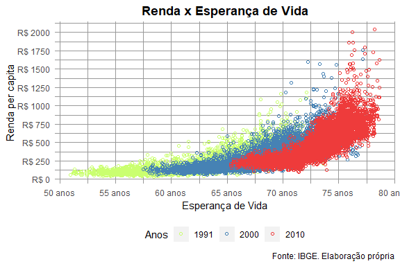
