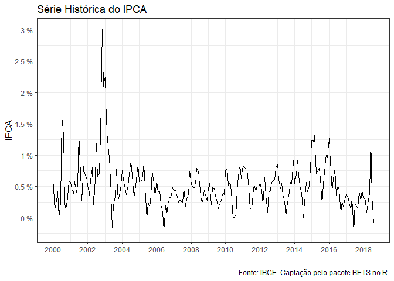
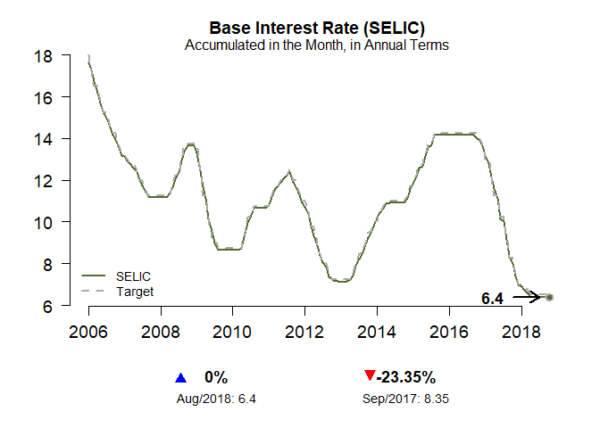
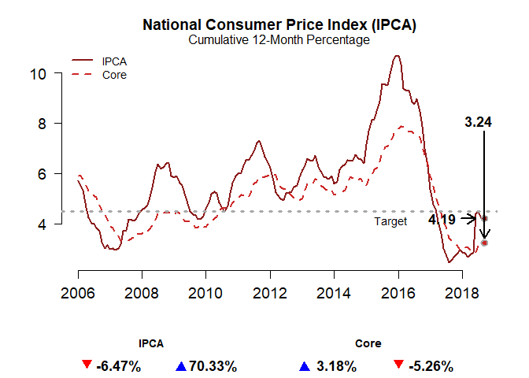
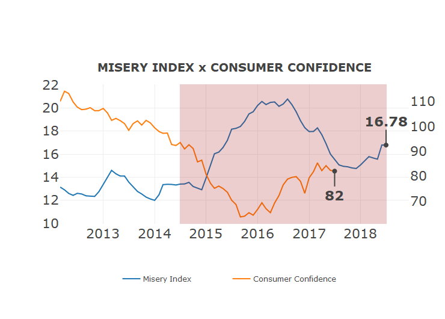
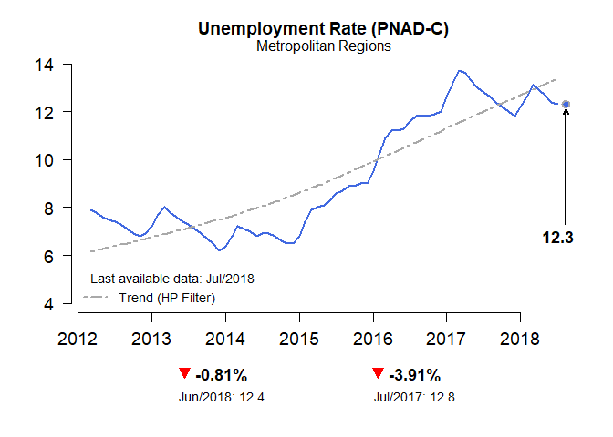
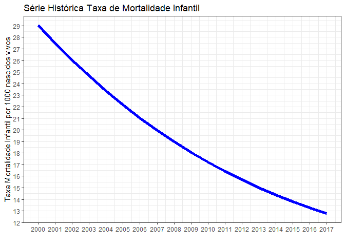

Pacotes para baixar dados
================
Marcelo Prudente
20 de setembro de 2018

``` r
library(tidyverse)
```

Alguns pacotes do **R** permitem captar informações diretamente das bases de dados relevantes sobre economia e dados sociais.

BETS
----

O primeiro pacote recomendado é o Brazilian Economic Time Series (BETS), que agrega dados o Banco central do Brasil (BACEN), o Instituto Brasileiro de Geografia e Estatística (IBGE) e o Instituto Brasileiro de Economia da Fundação Getúlio Vargas (FGV/IBRE).

Para saber mais sobre o pacote, [acesse](https://bibliotecadigital.fgv.br/dspace/bitstream/handle/10438/18172/Brazilian_Economic_Time_Series_BETS_R_package.pdf)

### Instalando o BETS

``` r
# instalar
install.packages("BETS")
```

``` r
# carregar
library(BETS)
```

### Identificando as bases disponíveis

Para identificar uma série no BETS, você deve utilizar o comando BETSsearch. Por exemplo, vamos procurar dados sobre ipca cuja fonte seja o IBGE.

``` r
# argumentos do comando
args(BETSsearch)
```

``` r
# procurar dados do IPCA
fontes_dados_ipca <- BETSsearch("ipca", src = "IBGE") 
```

Com isso, você encontrará todas as bases disponíveis com esses dados, conforme a tabela abaixo.

   
| code  | description                                                                             | unit           | periodicity | start      | last\_value | source |
|:------|:----------------------------------------------------------------------------------------|:---------------|:------------|:-----------|:------------|:-------|
| 10764 | National Consumer Price Index-Extended - Special (IPCA-E)                               | Monthly % var. | M           | 31/01/1992 | mar/2018    | IBGE   |
| 13522 | National consumer price index (IPCA) - in 12 months                                     | %              | M           | 01/12/1980 | mar/2018    | IBGE   |
| 1635  | Broad national consumer price index (IPCA) - Food and beverages                         | Monthly % var. | M           | 31/01/1991 | mar/2018    | IBGE   |
| 1636  | Broad national consumer price index (IPCA) - Housing                                    | Monthly % var. | M           | 31/01/1991 | mar/2018    | IBGE   |
| 1637  | Broad national consumer price index (IPCA) - Domestic goods                             | Monthly % var. | M           | 31/01/1991 | mar/2018    | IBGE   |
| 1638  | Broad national consumer price index (IPCA) - Clothing                                   | Monthly % var. | M           | 31/01/1991 | mar/2018    | IBGE   |
| 1639  | Broad national consumer price index (IPCA) - Transport                                  | Monthly % var. | M           | 31/08/1999 | mar/2018    | IBGE   |
| 1640  | Broad national consumer price index (IPCA) - Communication                              | Monthly % var. | M           | 31/08/1999 | mar/2018    | IBGE   |
| 1641  | Broad national consumer price index (IPCA) - Health and personnal care                  | Monthly % var. | M           | 31/01/1991 | mar/2018    | IBGE   |
| 1642  | Broad national consumer price index (IPCA) - Personal expenditures                      | Monthly % var. | M           | 31/01/1991 | mar/2018    | IBGE   |
| 1643  | Broad national consumer price index (IPCA) - Education                                  | Monthly % var. | M           | 31/08/1999 | mar/2018    | IBGE   |
| 1655  | National Consumer Price Index (Extended) - IPCA - Transportation and communication      | Monthly % var. | M           | 31/01/1991 | jul/1999    | IBGE   |
| 433   | Broad National Consumer Price Index (IPCA)                                              | Monthly % var. | M           | 02/01/1980 | mar/2018    | IBGE   |
| 4450  | Broad national consumer price index (IPCA) - Supervised prices - Property tax           | Monthly % var. | M           | 01/01/1992 | jun/2006    | IBGE   |
| 4451  | Broad national consumer price index (IPCA) - Supervised prices - Water and sewage rates | Monthly % var. | M           | 31/01/1992 | mar/2018    | IBGE   |

Assim, podemos pegar o índice do IPCA desde d

``` r
ipca <- BETSget(433, from = "2000-01-01")
```

Depois, podemos plotar essa série histórica com a função autoplot do ggplot:

``` r
autoplot(ipca) + 
  labs(x = "", y = "IPCA", title = "Série Histórica do IPCA",
       caption = "Fonte: IBGE. Captação pelo pacote BETS no R.") +
  scale_x_continuous(breaks = seq(2000, 2018, 2)) + 
  scale_y_continuous(breaks = seq(0, 3, 0.5), labels = function(x) paste(x, "%")) +
  theme_bw()
```


 
Charts
------

Outro parâmetro interessante do BETS é a criação de gráficos pré-formatados e profissionais sobre alguns dados selecionados do país.É uma boa ferramenta, ainda que só possua gráficos em inglês. Para identificar as séries já organizadas, digite:

``` r
?chart
```


#### Taxa Selic

``` r
chart(ts = "selic")
```





#### Ipca e sua meta

``` r
chart("ipca_with_core")
```


#### Índice de Miséria e Confianca do Consumidor

``` r
chart("misery_index")
```


#### Desemprego

``` r
chart("unemp")
```



IPEADATA
--------

O pacote do ipeaData apresenta todos os dados do IPEA.

``` r
install.packages("ipeaData")
```

``` r
library(ipeaData)
```

A forma de obtenção dos dados é bastante simples. Porém, é necessário identificar o código das bases e as informações que elas contêm. Por isso, baixamos os metadados e o resultado será uma tabela como a apresentada resumidamente abaixo.

``` r
dados_ipea <- get_metadata(serie = NULL, type = "data.table")
colnames(dados_ipea)
```

    ##  [1] "SERCODIGO"          "SERNOME"            "SERCOMENTARIO"     
    ##  [4] "SERATUALIZACAO"     "BASNOME"            "FNTID"             
    ##  [7] "FNTSIGLA"           "FNTNOME"            "FNTURL"            
    ## [10] "PERNOME"            "UNINOME"            "MULNOME"           
    ## [13] "SERSTATUS"          "TEMCODIGO"          "TEMNOME"           
    ## [16] "TEMCODIGOPAI"       "PAICODIGO"          "SERNUMERICA"       
    ## [19] "SERTEMBR"           "SERTEMEST"          "SERTEMMUN"         
    ## [22] "SERTEMAMC"          "SERTEMMET"          "SERMINDATA"        
    ## [25] "SERMAXDATA"         "FNTEXTURL"          "SERPROGRAMAGERADOR"
    ## [28] "SERDECIMAIS"        "SERQNT"


| SERCODIGO     | SERNOME                                    | SERCOMENTARIO                                                                                                                                                                                                                                                                                                                                                                                                                                                                                                                                                                                                                                                                                                                                                                                                                                                                                                                                                                                                                                                                                                                    |
|:--------------|:-------------------------------------------|:---------------------------------------------------------------------------------------------------------------------------------------------------------------------------------------------------------------------------------------------------------------------------------------------------------------------------------------------------------------------------------------------------------------------------------------------------------------------------------------------------------------------------------------------------------------------------------------------------------------------------------------------------------------------------------------------------------------------------------------------------------------------------------------------------------------------------------------------------------------------------------------------------------------------------------------------------------------------------------------------------------------------------------------------------------------------------------------------------------------------------------|
| ABATE\_ABPEAV | Abate - aves - peso das carcaças - qde.    | Fontes: Para 1975 - 1996: Pesquisa Mensal de Abate de Animais, IBGE. Até 1996 as informações sobre o número de cabeças abatidas e o peso total das carcaças dos rebanhos tem como unidade de coleta os estabelecimentos cuja atividade principal ou secundária era o abate de animais. A partir de 1997 a pesquisa passou a ser trimestral, tendo como unidade de coleta todos os estabelecimentos que efetuam a atividade de abate de animais e estão sob inspeção federal, estadual ou municipal, ou seja, não está sendo considerado o abate clandestino. Para 1958-1974: Estatísticas históricas do Brasil: séries econômicas, demográficas e sociais de 1550 a 1988. 2. ed. rev. e atual. do v. 3 de Séries estatísticas retrospectivas. Rio de Janeiro: IBGE, 1990. Apud: Estatísticas do século XX, Centro de documentação e disseminação de informações. Rio de Janeiro: IBGE, 2003. Obs.: Corresponde ao peso das carcaças de aves abatidas.                                                                                                                                                                            |
| ABATE\_ABPEBV | Abate - bovinos - peso das carcaças - qde. | Fontes: Para 1975 - 1996: Pesquisa Mensal de Abate de Animais, IBGE. Até 1996 as informações sobre o número de cabeças abatidas e o peso total das carcaças dos rebanhos tem como unidade de coleta os estabelecimentos cuja atividade principal ou secundária era o abate de animais. A partir de 1997 a pesquisa passou a ser trimestral, tendo como unidade de coleta todos os estabelecimentos que efetuam a atividade de abate de animais e estão sob inspeção federal, estadual ou municipal, ou seja, não está sendo considerado o abate clandestino. Para 1958-1974: Estatísticas históricas do Brasil: séries econômicas, demográficas e sociais de 1550 a 1988. 2. ed. rev. e atual. do v. 3 de Séries estatísticas retrospectivas. Rio de Janeiro: IBGE, 1990. Apud: Estatísticas do século XX, Centro de documentação e disseminação de informações. Rio de Janeiro: IBGE, 2003. Obs.: Corresponde ao peso das carcaças de bovinos (bois, vacas, novilhos e vitelos) abatidos.                                                                                                                                       |
| ABATE\_ABPESU | Abate - suínos - peso das carcaças - qde.  | Fontes: Para 1975 - 1996: Pesquisa Mensal de Abate de Animais, IBGE. Até 1996 as informações sobre o número de cabeças abatidas e o peso total das carcaças dos rebanhos tem como unidade de coleta os estabelecimentos cuja atividade principal ou secundária era o abate de animais. A partir de 1997 a pesquisa passou a ser trimestral, tendo como unidade de coleta todos os estabelecimentos que efetuam a atividade de abate de animais e estão sob inspeção federal, estadual ou municipal, ou seja, não está sendo considerado o abate clandestino.Para 1958-1974: Estatísticas históricas do Brasil: séries econômicas, demográficas e sociais de 1550 a 1988. 2. ed. rev. e atual. do v. 3 de Séries estatísticas retrospectivas. Rio de Janeiro: IBGE, 1990. Apud: Estatísticas do século XX, Centro de documentação e disseminação de informações. Rio de Janeiro: IBGE, 2003. Obs.: Corresponde ao peso das carcaças de suínos abatidos.                                                                                                                                                                           |
| ABATE\_ABQUAV | Abate - aves - qde.                        | Fontes: Para 1975 - 1996: Pesquisa Mensal de Abate de Animais, IBGE. Até 1996 as informações sobre o número de cabeças abatidas e o peso total das carcaças dos rebanhos tem como unidade de coleta os estabelecimentos cuja atividade principal ou secundária era o abate de animais. A partir de 1997 a pesquisa passou a ser trimestral, tendo como unidade de coleta todos os estabelecimentos que efetuam a atividade de abate de animais e estão sob inspeção federal, estadual ou municipal, ou seja, não está sendo considerado o abate clandestino.Para 1958-1974: Estatísticas históricas do Brasil: séries econômicas, demográficas e sociais de 1550 a 1988. 2. ed. rev. e atual. do v. 3 de Séries estatísticas retrospectivas. Rio de Janeiro: IBGE, 1990. Apud: Estatísticas do século XX, Centro de documentação e disseminação de informações. Rio de Janeiro: IBGE, 2003. Obs.: Corresponde à quantidade de aves abatidas.                                                                                                                                                                                     |
| ABATE\_ABQUBV | Abate - bovinos - qde.                     | Fontes: Para 1975 - 1996: Pesquisa Mensal de Abate de Animais, IBGE. Até 1996 as informações sobre o número de cabeças abatidas e o peso total das carcaças dos rebanhos tem como unidade de coleta os estabelecimentos cuja atividade principal ou secundária era o abate de animais. A partir de 1997 a pesquisa passou a ser trimestral, tendo como unidade de coleta todos os estabelecimentos que efetuam a atividade de abate de animais e estão sob inspeção federal, estadual ou municipal, ou seja, não está sendo considerado o abate clandestino.Para 1936-1974: Estatísticas históricas do Brasil: séries econômicas, demográficas e sociais de 1550 a 1988. 2. ed. rev. e atual. do v. 3 de Séries estatísticas retrospectivas. Rio de Janeiro: IBGE, 1990. Apud: Estatísticas do século XX, Centro de documentação e disseminação de informações. Rio de Janeiro: IBGE, 2003. Para 1900-1935: Haddad, Claudio Luiz da Silva. Crescimento do produto real no Brasil, 1900-1947. Rio de Janeiro: Fundação Getulio Vargas, 1978. Obs: Corresponde à quantidade de bovinos (bois, vacas, novilhos e vitelos) abatidos. |
| ABATE\_ABQUSU | Abate - suínos - qde.                      | Fontes: Para 1975 - 1996: Pesquisa Mensal de Abate de Animais, IBGE. Até 1996 as informações sobre o número de cabeças abatidas e o peso total das carcaças dos rebanhos tem como unidade de coleta os estabelecimentos cuja atividade principal ou secundária era o abate de animais. A partir de 1997 a pesquisa passou a ser trimestral, tendo como unidade de coleta todos os estabelecimentos que efetuam a atividade de abate de animais e estão sob inspeção federal, estadual ou municipal, ou seja, não está sendo considerado o abate clandestino.Para 1936-1974: Estatísticas históricas do Brasil: séries econômicas, demográficas e sociais de 1550 a 1988. 2. ed. rev. e atual. do v. 3 de Séries estatísticas retrospectivas. Rio de Janeiro: IBGE, 1990. Apud: Estatísticas do século XX, Centro de documentação e disseminação de informações. Rio de Janeiro: IBGE, 2003. Para 1900-1935: Haddad, Claudio Luiz da Silva. Crescimento do produto real no Brasil, 1900-1947. Rio de Janeiro: Fundação Getulio Vargas, 1978. Obs.: Corresponde à quantidade de suínos abatidos.                                   |

Por exemplo, é possível baixar a série histórica da taxa de mortalidade infantil (TMI) e, em seguida, produzir o gráfico com sua evolução.

``` r
# taxa de mortalidade infantil
depis_tmi <- ipeadata("DEPIS_TMI")
```

    ## [1] "Instituto Brasileiro de Geografia e Estatística, Departamento de População e Indicadores Sociais. Divisão de Estudos e Análises da Dinâmica Demográfica (IBGE/Pop). 01/2000 a 01/2017. Acesso em: 20/09/2018"

``` r
depis_tmi %>% 
  ggplot(aes(x = ANO, y = VALVALOR)) + 
  geom_line( size = 2, color = "blue") +
  labs(x ="", y = "Taxa Mortalidade Infantil por 1000 nascidos vivos",
       title = "Série Histórica Taxa de Mortalidade Infantil") +
  scale_x_continuous(breaks = 2000:2017) +
  scale_y_continuous(breaks = seq(0, 30, 1)) +
  theme_bw()
```

